#### These procedure steps will be followed on the simulator

1. When you click on a Total Iron in water file, a new window will open as shown below, go through the Description and Solutions used, then click on the NEXT button at the bottom right corner to move to the next step.  
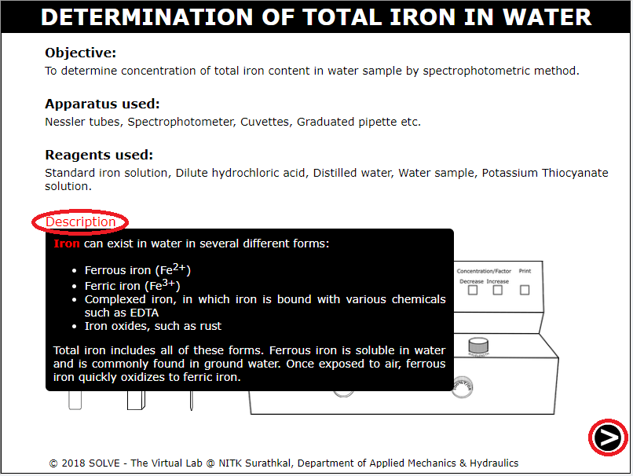 

2. Click on cap of the solution to remove it and then on pipette to take out 100ml of standard iron solution and add it to six Nessler Tube each. 
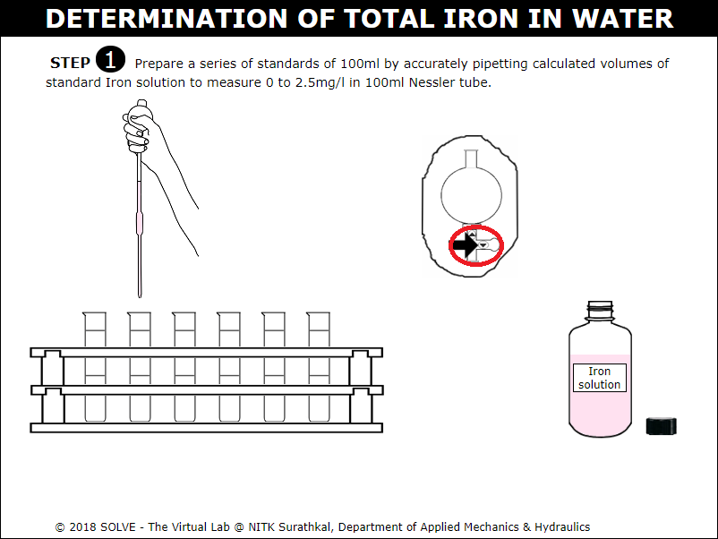 

3. Click on pipette, use upper and lower arrow shown in the pipette to collect solution and add it to the Nessler tube, click on NEXT button to proceed.  
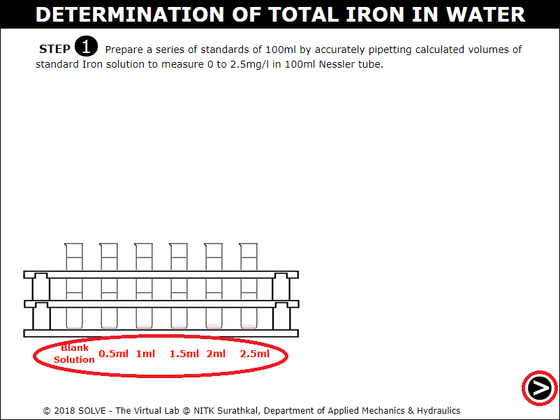 

4. Click on cap of the solution to remove it and then click on the up arrow on pipette bulb to take out 2ml of tap water and 2ml of water sample. 
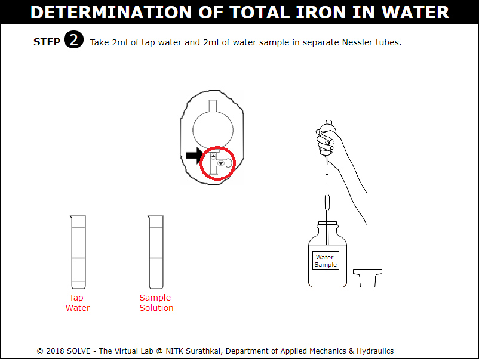 

5. Add 4ml dilute hydrochloric acid to all the Nessler tubes.  
 

6. Add 5ml of Potassium Thiocyanate solution to all the Nessler tubes. Then add distilled water to the Nessler tubes up to the mark of 100ml.  
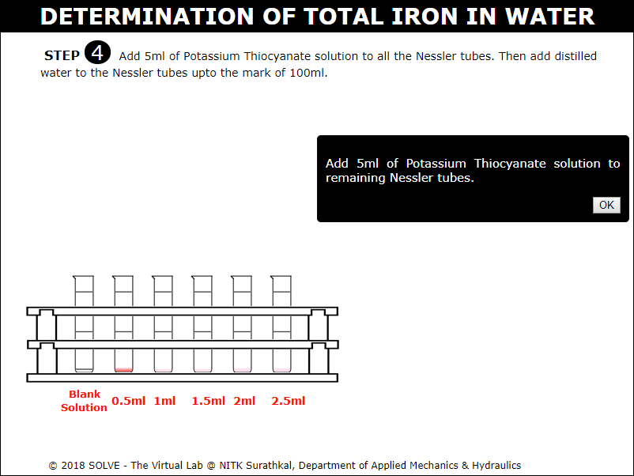 

7. Select answer to the displayed question and then click on NEXT button to proceed. 
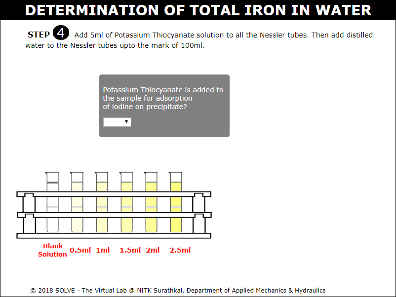 

8. Fill the cuvette with blank solution and place it in spectrophotometer. Set the wavelength to 510nm by adjusting wavelength control knob. 
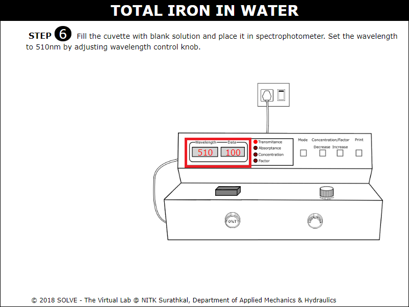 

9. Place the cuvette in the spectrophotometer, then measure absorbance and transmittance value. 
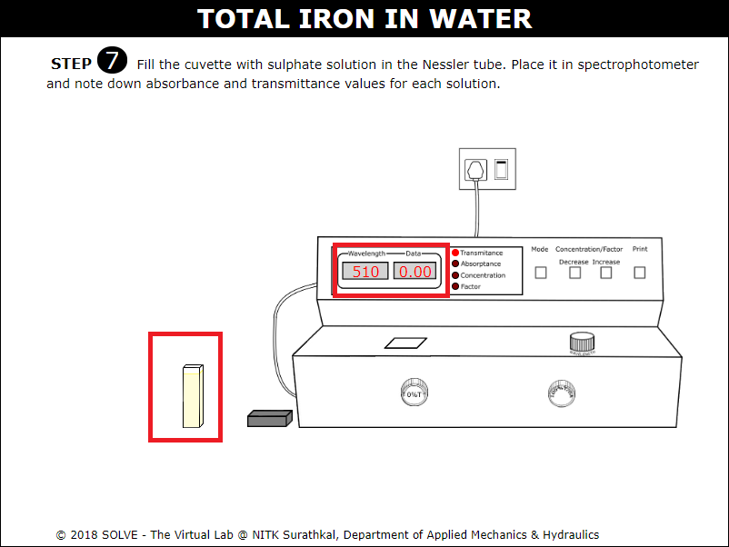 

10. Note down the absorbance and transmittance value of all the remaining solutions and select the answer to the given question to proceed. 
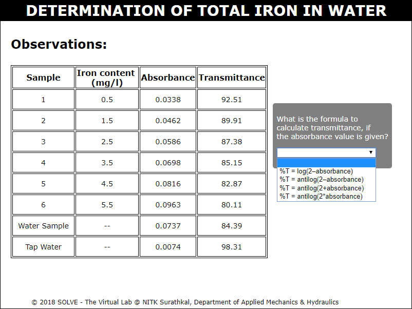 

11. Click on Iron concentration v/s Absorbance, hover over the water sample point in the characteristic curve to see the value and then enter it as result. 
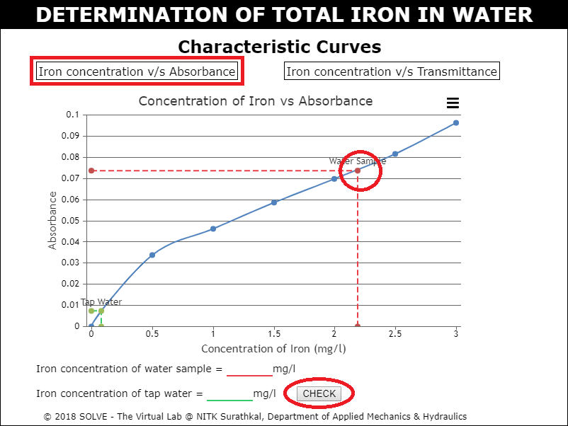 

12. Click on Iron concentration v/s Transmittance, hover over the water sample point in the characteristic curve to see the value and then enter it as result and then click on CHECK button. 
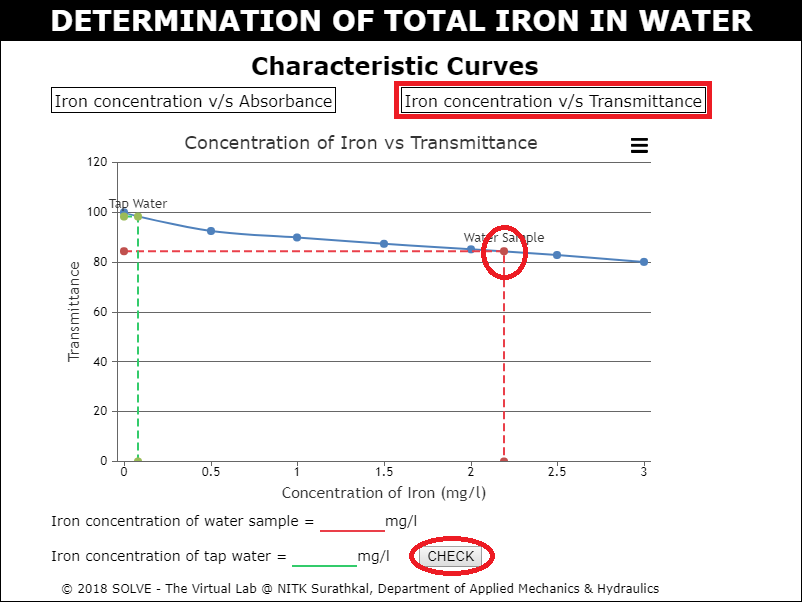 
